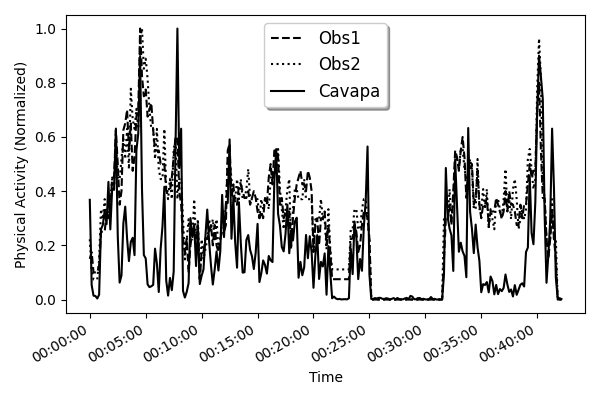

# cavapa-data
Data processing python scripts (a [Jupyter Notebook](https://jupyter.org/)) for [CAVAPA: Computer Assisted Video Analysis of Physical Activity](https://cavapa.ruthenbeck.io). A live version of the Notebook is available on <https://binder.org> here: [](https://mybinder.org/v2/gh/gregruthenbeck/cavapa-data/HEAD?filepath=cavapa_data_jupyter_notebook.ipynb).

Generates the following charts:

| [](./output/plots/cavapa_gym_hr_acc.png) |
|:--:|
| Fig.1 - CAVAPA, Heart-rate, Accelerometers for an Indoor Video  |

| [](./output/plots/cavapa_gym_obs.png) |
|:--:|
| Fig.2 - CAVAPA, Observed A, Observed B for an Indoor Video  |

| [](./output/plots/cavapa_kilp_obs.png) |
|:--:|
| Fig.3 - CAVAPA, Observed, for an Outdoor Video  |

This GitHub Repo is a continuation of [this GitHub Gist](https://gist.github.com/gregruthenbeck/32556e31418e9c9d83de0b6989b9999f).

## Quickstart

```
git clone git@github.com:gregruthenbeck/cavapa-data.git
cd cavapa-data
pipenv install
pipenv shell
jupyter-notebook cavapa_data_jupyter_notebook.ipynb
```
